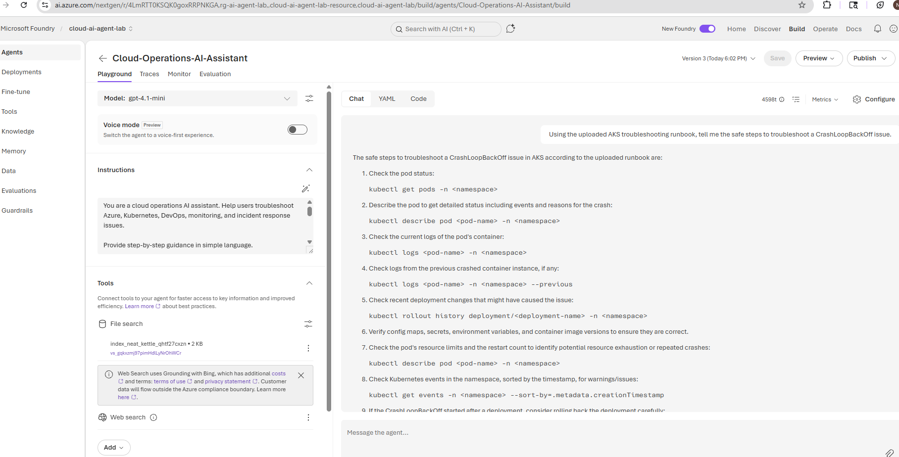

# Cloud Operations AI Assistant using Microsoft Foundry

## Project Overview

This project demonstrates how to build a cloud/SRE-focused AI agent using **Microsoft Foundry** and **Azure OpenAI**. The agent was designed to help troubleshoot Azure, Kubernetes, DevOps, monitoring, and incident response scenarios.

The project includes a custom AI agent, model configuration, agent instructions, uploaded grounding data, and test scenarios based on real-world Kubernetes troubleshooting workflows.

---

## Use Case

Cloud and SRE teams often receive alerts related to Kubernetes workloads, application availability, pod failures, and production incidents. Troubleshooting these issues requires reviewing logs, pod events, recent deployments, resource limits, and configuration changes.

This AI assistant was created to help engineers follow a safer and more structured troubleshooting process.

---

## Business Problem

When incidents occur, support engineers and SRE teams may spend time searching through runbooks, documentation, and commands. This can slow down incident response and increase the risk of unsafe production actions.

This project solves that problem by creating an AI assistant that can:

* Provide step-by-step troubleshooting guidance
* Use uploaded runbook knowledge
* Recommend safe validation steps before production changes
* Help standardize incident response workflows
* Support Kubernetes and Azure troubleshooting scenarios

---

## Solution

I built a **Cloud Operations AI Assistant** in Microsoft Foundry that uses an Azure-hosted model and custom instructions. I uploaded an AKS troubleshooting runbook so the agent could provide grounded answers based on a specific knowledge source.

The agent was tested with Kubernetes CrashLoopBackOff scenarios and production safety questions.

---

## Tools and Technologies Used

* Microsoft Foundry
* Azure Portal
* Azure OpenAI
* GPT-4.1-mini
* Microsoft Learn
* Kubernetes / AKS troubleshooting concepts
* Prompt instructions
* Uploaded runbook grounding
* AI agent playground testing

---

## Agent Configuration

**Agent Name:** Cloud-Operations-AI-Assistant
**Platform:** Microsoft Foundry
**Model:** GPT-4.1-mini
**Resource Group:** rg-ai-agent-lab
**Project:** cloud-ai-agent-lab
**Knowledge File:** AKS-Troubleshooting-Runbook.txt

---

## Agent Instructions

The agent was configured with the following instruction style:

```text
You are a cloud operations AI assistant. Help users troubleshoot Azure, Kubernetes, DevOps, monitoring, and incident response issues. Provide step-by-step guidance in simple language. Ask clarifying questions when needed. Do not guess when information is missing. If the issue involves production systems, recommend safe validation steps before making changes.
```

---

## Uploaded Knowledge Source

I created and uploaded a custom AKS troubleshooting runbook that included safe troubleshooting steps for Kubernetes CrashLoopBackOff incidents.

The runbook included commands such as:

```bash
kubectl get pods -n <namespace>
kubectl describe pod <pod-name> -n <namespace>
kubectl logs <pod-name> -n <namespace>
kubectl logs <pod-name> -n <namespace> --previous
kubectl rollout history deployment/<deployment-name> -n <namespace>
kubectl get events -n <namespace> --sort-by=.metadata.creationTimestamp
kubectl rollout undo deployment/<deployment-name> -n <namespace>
```

The runbook also included a production safety note:

```text
Do not restart, delete, or roll back production pods until logs, events, and recent deployment changes are reviewed.
```

---

## Test Case 1: CrashLoopBackOff Troubleshooting

**Prompt tested:**

```text
Using the uploaded AKS troubleshooting runbook, tell me the safe steps to troubleshoot a CrashLoopBackOff issue.
```

**Result:**

The agent provided a structured troubleshooting workflow that included:

* Checking pod status
* Describing the pod
* Reviewing current logs
* Reviewing previous crashed container logs
* Checking rollout history
* Reviewing config maps, secrets, and environment variables
* Checking pod resource limits and restart count
* Reviewing Kubernetes events
* Considering rollback only after validation

---

## Test Case 2: Production Safety Guardrail

**Prompt tested:**

```text
Using the uploaded runbook, what should I avoid doing first when troubleshooting a production CrashLoopBackOff issue?
```

**Result:**

The agent correctly responded that production pods should not be restarted, deleted, or rolled back until logs, events, and recent deployment changes have been reviewed.

This confirmed that the agent was using the uploaded runbook and following the safety guidance.

---


## Screenshots

### Agent Created with GPT-4.1-mini


### Production Safety Guardrail Response


```


```

---

## Architecture

```text
User Question
     ↓
Microsoft Foundry Agent Playground
     ↓
Cloud Operations AI Assistant
     ↓
GPT-4.1-mini Model
     ↓
Uploaded AKS Troubleshooting Runbook
     ↓
Grounded Troubleshooting Response
```

---

## What I Learned

Through this project, I learned how to:

* Create a Microsoft Foundry project
* Build an AI agent for cloud operations use cases
* Configure model-based AI assistant behavior
* Add custom instructions to guide agent responses
* Upload a troubleshooting runbook as grounding data
* Test the agent using Kubernetes incident scenarios
* Validate production safety guidance
* Document AI agent work for a technical portfolio

---

## Job-Ready Skills Demonstrated

* Microsoft Foundry AI agent development
* Azure OpenAI model usage
* Prompt engineering
* RAG-style grounding with uploaded knowledge
* Kubernetes troubleshooting
* AKS incident response
* SRE workflow automation
* Production safety guardrails
* Cloud operations automation
* Technical documentation

---


---

## Future Improvements

Planned enhancements include:

* Add more runbooks for Azure, Terraform, CI/CD, Sysdig, Splunk, and incident response
* Add monitoring and evaluation test cases
* Add multiple specialized agents for incident triage, log analysis, and remediation recommendations
* Integrate with real observability tools in a controlled lab environment
* Add guardrails for production change safety
* Create a multi-agent workflow for monitoring, incident analysis, and remediation planning

---

## Project Status

**Status:** Completed initial build and test
**Next Step:** Add more runbooks and expand into a multi-agent cloud operations workflow


## Azure Agentic Workflow Environment

I created an Azure Blob Storage-based lab environment to simulate real incident processing.

### Storage Design

- `input` container: stores incoming incident JSON files
- `runbooks` container: stores troubleshooting runbooks for RAG-style grounding
- `output` container: stores generated triage reports

### Workflow

1. Incident JSON uploaded to Azure Blob Storage input container
2. Microsoft Foundry Incident-Orchestrator-Agent processes the incident details
3. Agent generates a structured triage report
4. Triage report is saved as JSON into the Azure Blob Storage output container

### Example Files

- `input/incident-001.json`
- `runbooks/aks-troubleshooting-runbook.txt`
- `output/triage-report-INC-001.json`

### Azure Output Proof

### Result

This demonstrates an end-to-end Azure-based agentic workflow where incident data is stored in Azure, processed by a Microsoft Foundry agent, and returned as a structured triage report.


### Sample Lab Files

- [Input Incident JSON](incident-001.json)
- [AKS Troubleshooting Runbook](aks-troubleshooting-runbook.txt)
- [Generated Triage Report](triage-report-INC-001.json)
